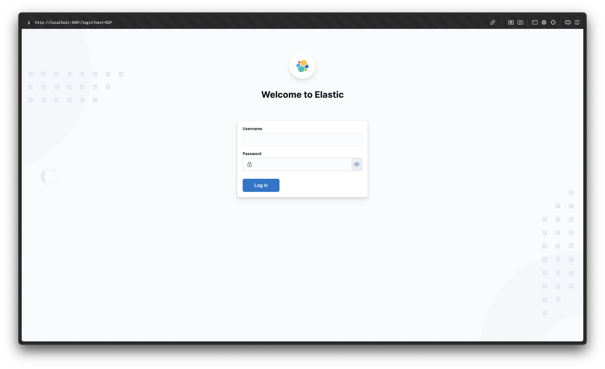

# LB2 Applikation

Diese Applikation ist bewusst unsicher programmiert und dient dazu, uns Lernenden die Augen für potenzielle Sicherheitslücken in Softwareanwendungen zu öffnen. Wir lernen, wie wir diese Lücken erkennen und beheben können. Dieses Projekt ist Teil der LB2 im [Modul 183](https://gitlab.com/ch-tbz-it/Stud/m183/m183).

## Applikation zum Laufen bringen

Um die Applikation zusammen mit Elasticsearch effizient zu nutzen, gehen wir wie folgt vor:

1. **Vorbereitung der Umgebung**:

   - Wir kopieren die Datei [.env.example](./.env.example) und benennen sie in `.env` um.
   - Falls notwendig, passen wir die Einstellungen in der `.env` Datei an unsere Bedürfnisse an.

2. **Dienste starten**:

   - Die Dienste werden mit `docker compose up -d` gestartet.
   - Anschliessend ist die Applikation unter [http://localhost:80](http://localhost:80) erreichbar.
     
   - Die Elastic Services sind unter [http://localhost:5601](http://localhost:5601) zu finden. Für den Login nutzen wir `elastic` als Benutzernamen und Passwort.
     

3. **Bei Zugriffsproblemen auf das Dashboard**:

   - Zeigt das Elastic Dashboard länger die Meldung `Kibana server is not ready yet.`, könnte dies auf ein Problem mit dem Passwort des `kibana_system` Benutzers hinweisen.
   - Bei Zugriffsproblemen können wir mit folgendem Befehl ein neues Passwort setzen:

     ```
     docker exec -it m183_lb2-elasticsearch-1 bin/elasticsearch-reset-password -u <username> -i <neues Passwort>
     ```

   - Wichtig ist, dass der entsprechende Container, `m183_lb2-elasticsearch-1`, dabei läuft.
   - Nach dem Zurücksetzen des Passworts müssen wir auch die Passwortvariablen in der `.env` Datei aktualisieren.

4. **Nutzung von Elastic Search**:

   - Nach dem Login erhalten wir Zugriff auf das gesamte Elastic Dashboard und seine Services.
     
   - Wir beginnen mit dem `Search` Service, um Logs als Dokumente einzusehen.
     
   - Unter dem `Analytics` Service im Dashboard-Tab können wir dann eigene Dashboards für unsere Logs erstellen. Wichtig zu wissen ist, dass diese Dashboards nur auf dem persistenten Volume gespeichert werden. Daher muss jeder Benutzer seine Dashboards neu anlegen. Dieses Problem kann leider nicht ohne Weiteres umgangen werden.
     

5. **Interaktion erforderlich für Logs**:
   - Wichtig: Logs in Elastic werden erst sichtbar, wenn mit der Applikation interagiert wurde. Das heisst, wir müssen bestimmte Aktionen in der Applikation ausführen, damit Logs generiert und in Elastic sichtbar werden.
